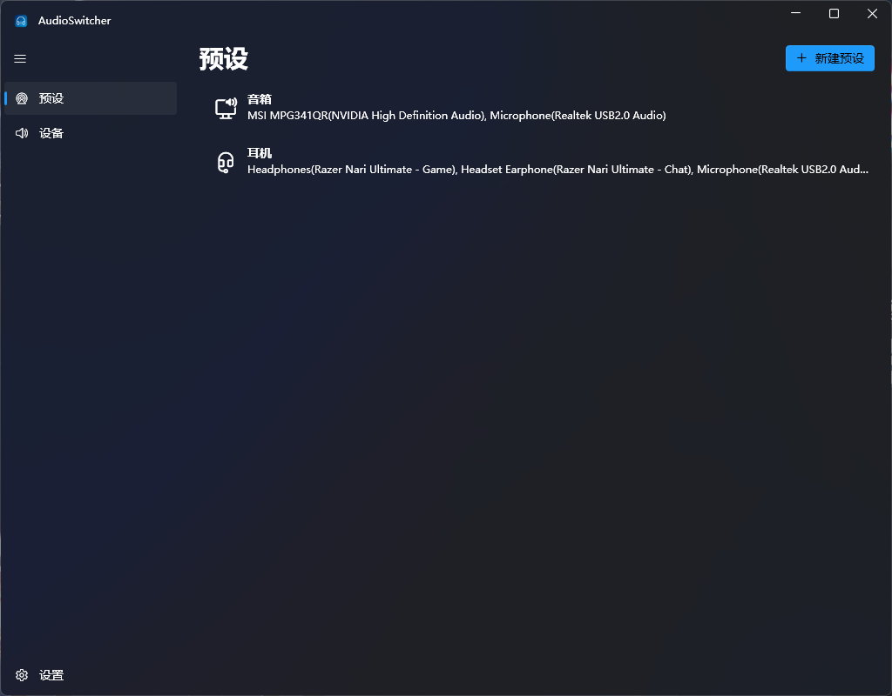
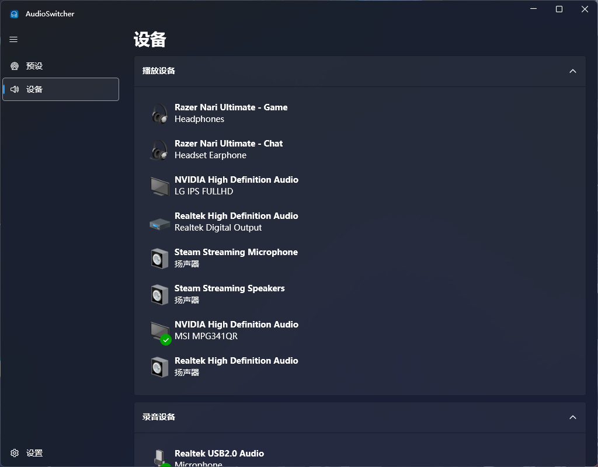
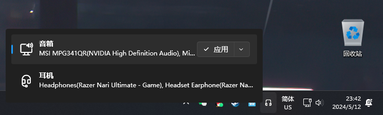
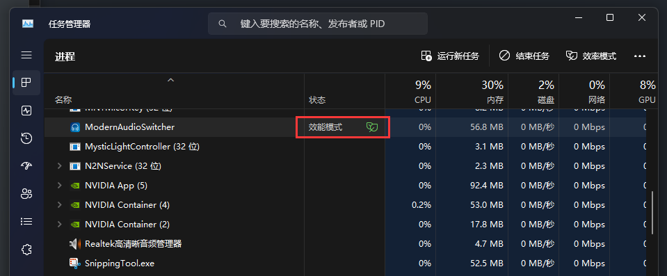

Audio Switcher
==============

This is a project based on [Audio-Switcher](https://github.com/davkean/audio-switcher) which you can switch your audio device quickly.

**New features:**

- Main UI with Fluent Design
- Presets support
- New tray UI
- Multi Languages support (Chinese & English)
- An option to set auto run when windows starting
- Support Efficiency Mode

## ScreenShot

**Presets**

**Devices**

**Tray Icon**

**Efficiency Mode**

